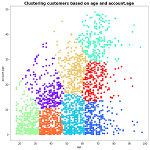

# K-Means Clustering

## Project Intro/Objective
K-Means clustering is employed on survey data from a credit union in Washington to gain insight and understanding into their members in this project. This unsupervised learning uses partitional clustering. 

This project uses Python and the following libraries :
* pandas

* numPy

* matplotlib

* scikit-learn 

* seaborn

 
 

## Project Description
A financial institution conducted a survey of 2,421 members to better understand their values and how they align with the company's values. The survey was based on the Moral Foundations Theory of Jonathan Haidt and measured 5 foundations and a single-number summary, Progressivism. Additionally, the survey measured Localism, Sustainability, and Education by using validated scales and questions. The results of the survey will be used to better align the current membership base with the company's values. More informaiton on the scales, questions and data can be seen int the appendix of the notebook. 

## Key learnings

1. K-means clustering can be used to analyze and interpret large datasets with many variables. 

2. The surveys results can be used to better understand the values of the members and how they align with the company's values.

3. K-means clustering can be used to identify and classify clusters of respondents based on their responses. 

4. If I were to update this project, I would use fewer clusters for ease of understanding and follow the Elbow Graph more closely. 
